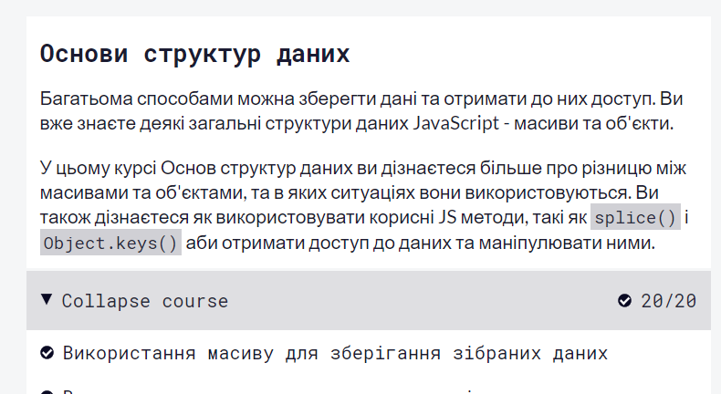

# kottans-frontend

# Thanks awesome [Kottans](https://kottans.org/):heartpulse:

## My journey

 1. **General**
    - [x] [Git Basics](#git_intro)
    - [x] [Linux CLI and Networking](#linux_networking)
    - [x] [VCS (hello gitty), GitHub and Collaboration](#git_collaboration)
  
 2. **Front-End Basics**
  
    - [x] [Intro to HTML & CSS](#intro_html_css)
    - [x] [Responsive Web Design](#responsive_web_design)
    - [ ] [HTML & CSS Practice](#)
    - [x] [JavaScript Basics](#js_basics)
    - [ ] [Document Object Model - practice](#)
  
 3. **Advanced Topics**

    - [ ] [Building a Tiny JS World (pre-OOP) - practice](#)
    - [ ] [Object oriented JS - practice](#)
    - [ ] [OOP exercise - practice](#)
    - [ ] [Offline Web Applications](#)
    - [ ] [Memory pair game — real project!](#)
    - [ ] [Website Performance Optimization](#)
    - [ ] [Friends App - real project!](#)

    ## General

    ### <a name="git_intro">Git Basics</a> 
    
    

Progress

 
    ### [Version Control with Git](https://www.udacity.com/course/version-control-with-git--ud123)
    
    
    ### [learngitbranching.js.org](https://learngitbranching.js.org/)
    
    
    
    It was my first  acquaintance with the Git so it was a bit hard for understanding but I did it. Also it's so exciting when you firstly don't understand smth but after hours of practice and efforts you overcame it. The course Version Control with Git has a lot of practice on your own computer, from basics up to some complicated things so it's better to start with this course, because learnbranching course gives you a consolidation of all you knowledge with interactive schemes or maps.
    So now I know how to create a new repository, how to create a new branch, how to switch between them, how to pull, push, merge, rebase and go on.It's awesome!
 
    

 
    ### <a name="linux_networking">Linux CLI and Networking</a>
    
    

Progress

    
    
    
    **Linux Survival** - is definitely improved my skills in command line, I learned a lof of new commands such as ls, cs, mkdir, kill, ps, aux, df, lpr, mv, ca and go on.But for sure I need to practice more.
    
    **HTTP/HTTPs** - there was a lot of a new information for me but it was a really interesting article. I figured out about the https and ssl sertificates, verbs and status codes and I know that it will help me in the future when I will work with frameworks or some libraries. By some time I will reread this article to remember more.
 
    

    
    ### <a name="git_collaboration">Git Collaboration</a>
    
    

Progress

    
    
    
    This Udacity is a really awesome platform for learning Git.However I learned how to push,pull(fetch and merge),make pull requests earlier but there is an essential information about working in team and how to collaborate with others developers.
 
    

    
    ## Front-End Basics
    
    ### <a name="#intro_html_css">Intro to HTML & CSS</a>
    
    

Progress

    
    ### <a name="#responsive_web_design">Responsive Web Design</a>
    

Progress

    
    
    
    
    
    I have had some knowledge about Flex and Grid before playing these funny games but it also was a useful information.
    

    
    ### <a name="#js_basics">JavaScript Basics</a>
    

Progress

    
    There are a lot of easy exercices.
    
    
    
    Information about some new features in ES6.
    
    
    
    It also wasn't very hard.
    
    
    
    It was a pretty hard.
    
    
    
    Also some information about OOP programming.
    
    
    
    A really hard challenges, takes a lot of my time.
    
    
    
    

